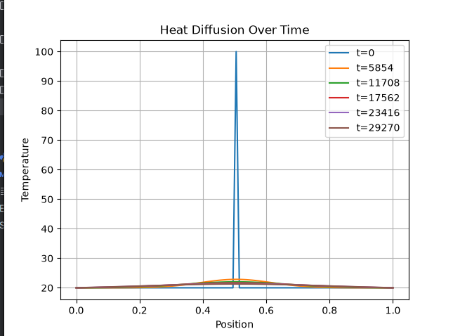

# Finite Difference Heat Equation Simulator

## Overview

This project simulates one-dimensional heat diffusion in a rod using the explicit finite difference method.

The simulation models how temperature evolves over time when a rod contains regions at different temperatures. Heat naturally flows from hotter regions to colder regions until thermal equilibrium is reached.

## Physical Background

Heat conduction in a homogeneous material is governed by the heat equation.

The rate at which heat spreads depends on the material's thermal diffusivity.

Examples:

* Copper transfers heat rapidly.
* Steel transfers heat more slowly.
* Glass transfers heat very slowly.

## Numerical Method

The rod is divided into discrete spatial points.

Instead of solving the continuous heat equation directly, the spatial and temporal derivatives are approximated using finite differences.

At each timestep, the temperature of every interior point is updated using the temperatures of its neighboring points.

The simulation uses the explicit finite difference method.

### Stability Condition

For numerical stability:

r = alpha * dt / dx^2 <= 0.5

If this condition is violated, the solution becomes unstable.

## Features

* 1D heat diffusion simulation
* Configurable material properties
* Temperature history storage
* Static result plots
* Time evolution visualization
* Multiple boundary condition support (future work)

## Example

Initial condition:

20°C 20°C 20°C 100°C 20°C 20°C

After several timesteps:

32°C 36°C 42°C 45°C 42°C 36°C

Final state:

40°C 40°C 40°C 40°C 40°C 40°C

## Results

Insert screenshots here.

### Temperature Evolution

### Animation

Add generated GIF here.

## Repository Structure

src/

* solver_1d.py
* plotter.py
* materials.py

docs/

* derivation.md

examples/

* hot_spot_rod.py

## Future Improvements

* 2D heat diffusion
* Heat sources and sinks
* Convective cooling
* Comparison with real sensor measurements
* GPU acceleration

## References

* Concepts in Thermal Physics, Blundell & Blundell
* Thermodynamics and Energy Conversion, Struchtrup

